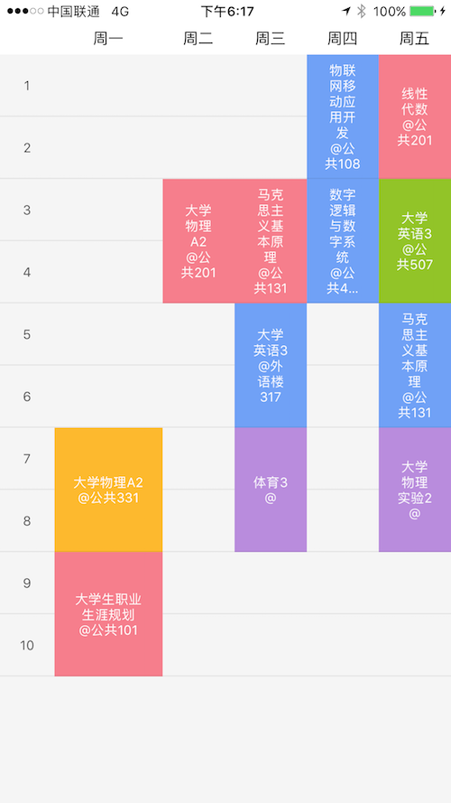

# GWPCourseListView，一个简单实用的课程表控件

## Install：
- ```git clone```本项目后，里面有一个`GWPCourseListView`文件夹，直接将该文件夹拖入项目即可。

## Use:
- `GWPCourseListView`直接继承自`UIView`，控件布局方面没有任何特殊要求。
- 基本的几个代理方法，实现数据回调

```
#pragma mark - GWPCourseListViewDataSource
- (NSArray<id<Course>> *)courseForCourseListView:(GWPCourseListView *)courseListView{
    return self.courseArr;
}

/** 课程单元背景色自定义 */
- (UIColor *)courseListView:(GWPCourseListView *)courseListView courseTitleBackgroundColorForCourse:(id<Course>)course{
    if ([course isEqual:[self.courseArr firstObject]]) {    // 第一个，返回自定义颜色
        return [UIColor blueColor];
    }
    
    // 其他返回默认的随机色
    return nil;
}

/** 设置选项卡的title的文字属性，如果实现该方法，该方法返回的attribute将会是attributeString的属性 */
- (NSDictionary*)courseListView:(GWPCourseListView *)courseListView titleAttributesInTopbarAtIndex:(NSInteger)index{
    if (index==0) {
        return @{NSForegroundColorAttributeName:[UIColor greenColor], NSFontAttributeName:[UIFont systemFontOfSize:18]};
    }
    
    return nil;
}
/** 设置选项卡的title的背景颜色，默认白色 */
- (UIColor*)courseListView:(GWPCourseListView *)courseListView titleBackgroundColorInTopbarAtIndex:(NSInteger)index{
    if (index==1) {
        return [UIColor purpleColor];
    }
    
    return nil;
}

#pragma mark - GWPCourseListViewDelegate
/** 选中(点击)某一个课程单元之后的回调 */
- (void)courseListView:(GWPCourseListView *)courseListView didSelectedCourse:(id<Course>)course{
    
}
```
- 项目中的CourseModel并非必需，您可以自定义模型，只要遵守Course协议即可。

其他见DEMO

## 集成后使用效果



